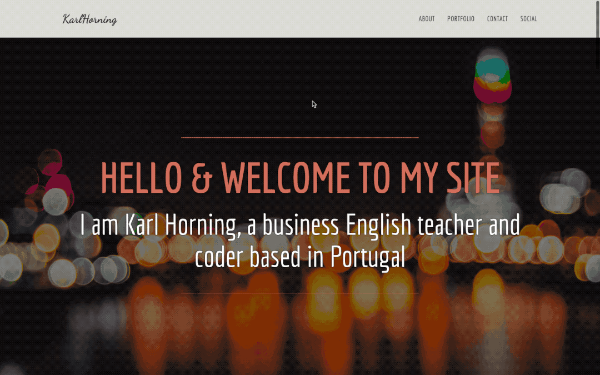

# Karl Horning's Portfolio

## Table of Contents

- [Description](#description)
- [Features](#features)
- [Demo](#demo)
- [Prerequisites](#prerequisites)
- [Installation](#installation)
- [Usage](#usage)
- [Troubleshooting](#troubleshooting)
- [Contributing](#contributing)
- [License](#license)
- [Contact](#contact)

## Description

Welcome to Karl Horning's portfolio website! This project showcases Karl's skills and projects as a business English teacher and coder based in Portugal. The website features various sections including an about me page, portfolio, contact form, and social links.

## Features

- Responsive design for a seamless experience across different devices.
- Customized styling using Bootstrap, Font Awesome, and Google Fonts.
- Sections include about me, portfolio, contact form, and social links.

## Demo

View the live demo on CodePen: [Karl Horning's Portfolio Webpage](https://codepen.io/karlhorning/pen/GjoZzq).

## Prerequisites

Make sure you have a web browser to view the project.

## Installation

To run this project locally, follow these steps:

1. Clone the repository: `git clone https://github.com/Karl-Horning/portfolio-2016.git`
2. Navigate to the project directory: `cd portfolio-2016`
3. Open `index.html` in your preferred web browser.

## Usage

Explore the different sections of the portfolio to learn more about Karl Horning's background, view his projects in the portfolio section, and get in touch using the contact form.

## Troubleshooting

- If you encounter any issues during installation or execution, please ensure that your web browser is up to date.

## Contributing

Contributions are welcome! Please follow these guidelines:

1. Fork the repository.
2. Create a new branch for your feature or bug fix.
3. Make your changes and ensure that the project still works.
4. Create a pull request with a clear description of your changes.

## License

This project is licensed under the [MIT License](./LICENSE).

## Contact

For any inquiries or support related to this portfolio, please contact Karl Horning.

## Author

Karl Horning: [GitHub](https://github.com/Karl-Horning/) | [LinkedIn](https://www.linkedin.com/in/karl-horning/) | [CodePen](https://codepen.io/karlhorning)